# MERN - Auth
This project is a MERN (MongoDB, Express, React, Node.js) stack application focused on authentication. It provides a comprehensive solution for user management, including registration, login, and email verification. The application ensures secure password encryption and uses JWT for authentication. Additionally, it features an admin panel for managing users, tracking login and logout history, monitoring failed login attempts, and implementing account lockout mechanisms to enhance security.

## Features

- User registration
- User login
- Email verification
- Password encryption
- JWT authentication
- Admin panel access
- User login and logout history
- Failed login attempts and account lockout

## Contributing

Contributions are welcome! Please open an issue or submit a pull request.

## Screenshots

### Client Side

#### Homepage
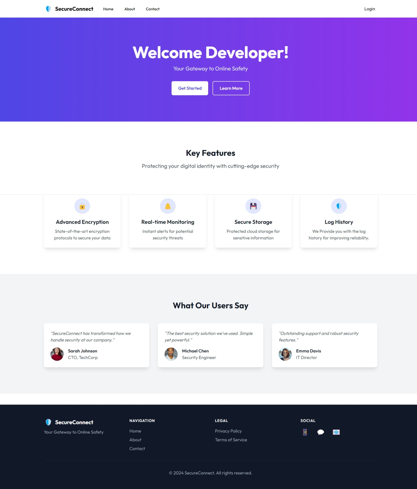

#### About Page
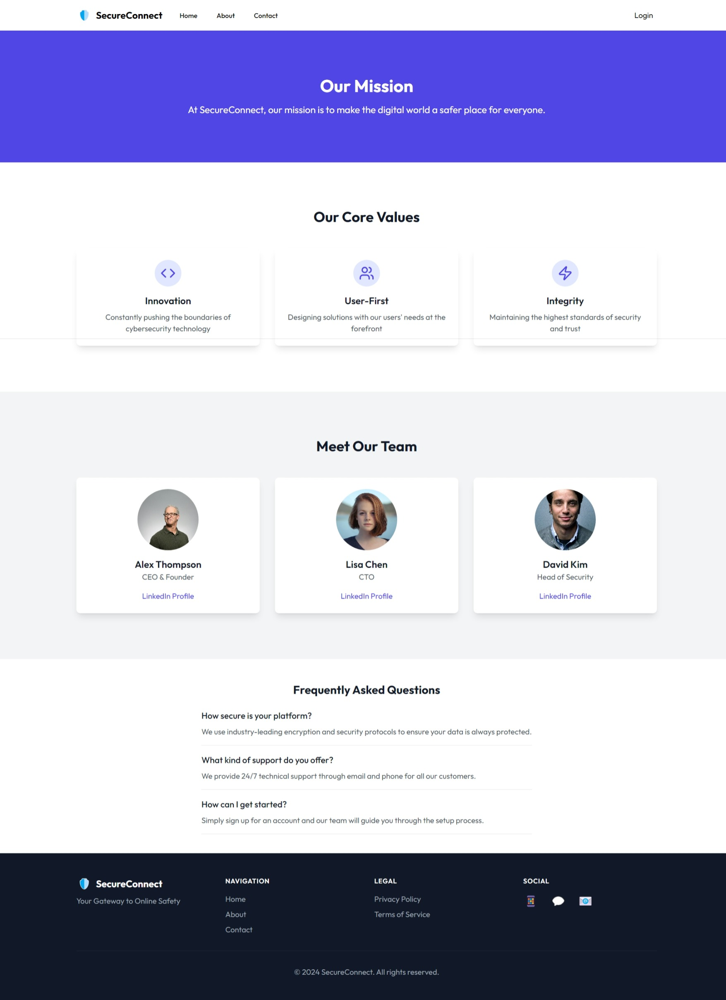

#### Contact Page
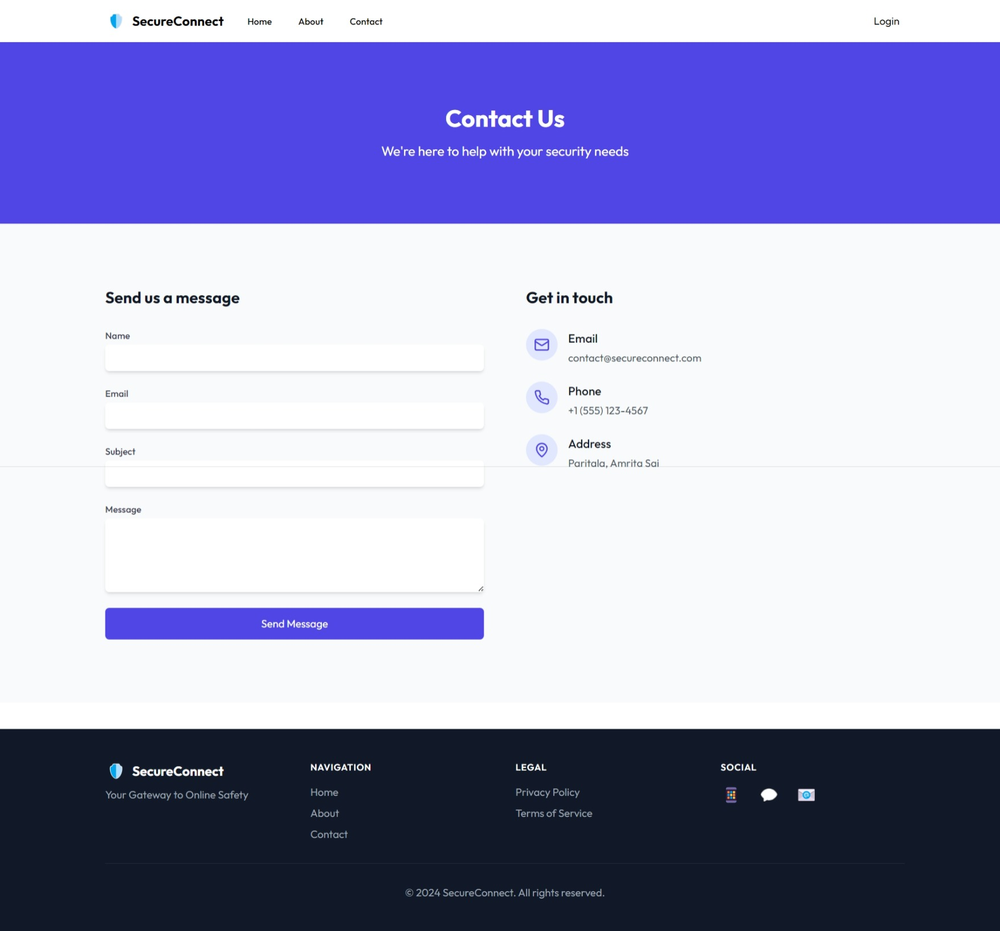

#### Register Page
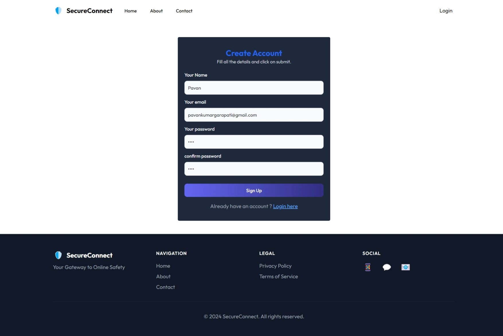

#### Login Page
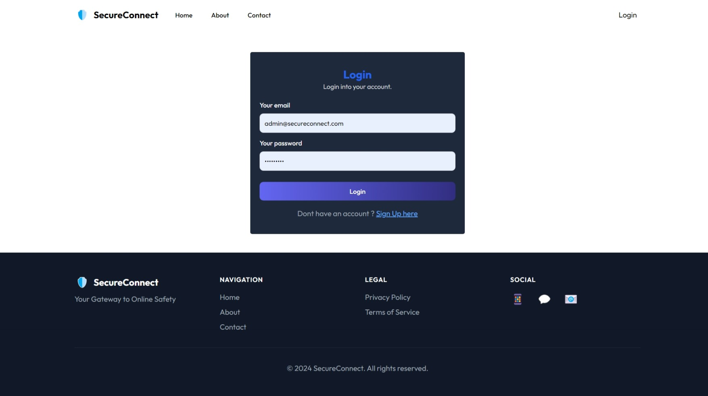

#### Login Successful
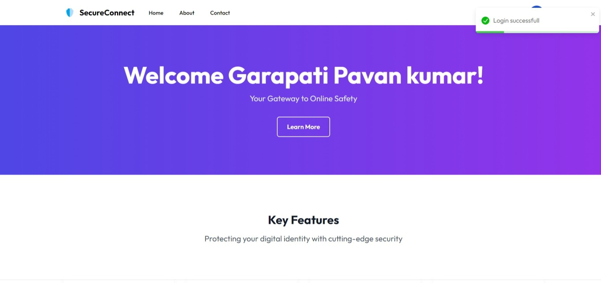

#### Verify Email
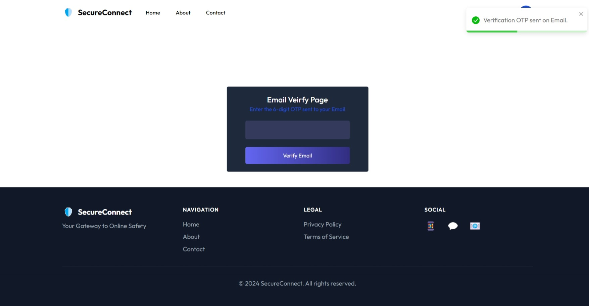

#### Account Verified
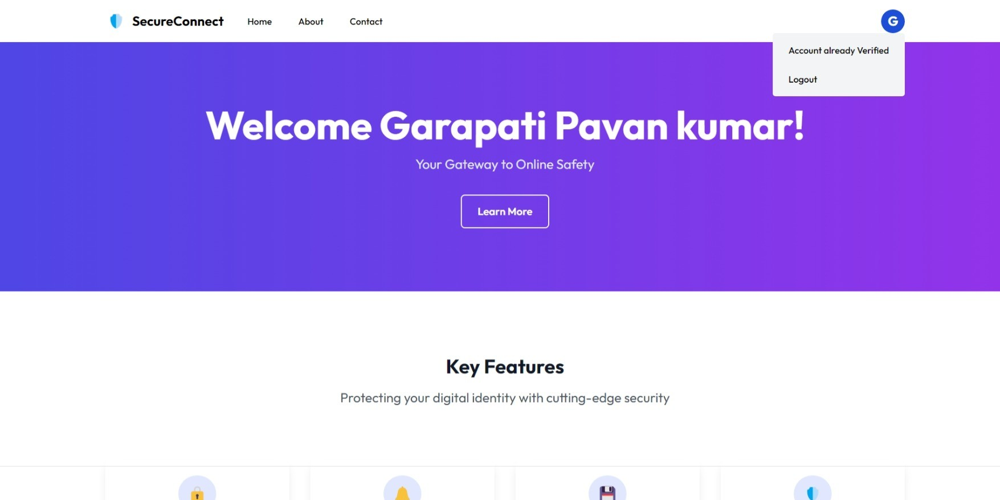

### Admin Side

#### Admin Login
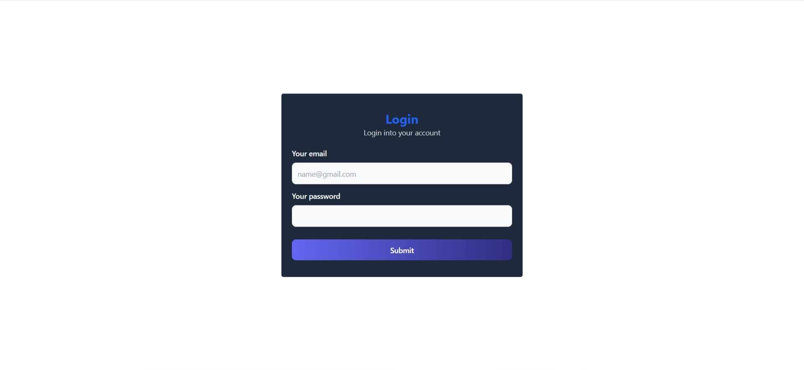

#### Admin Dashboard
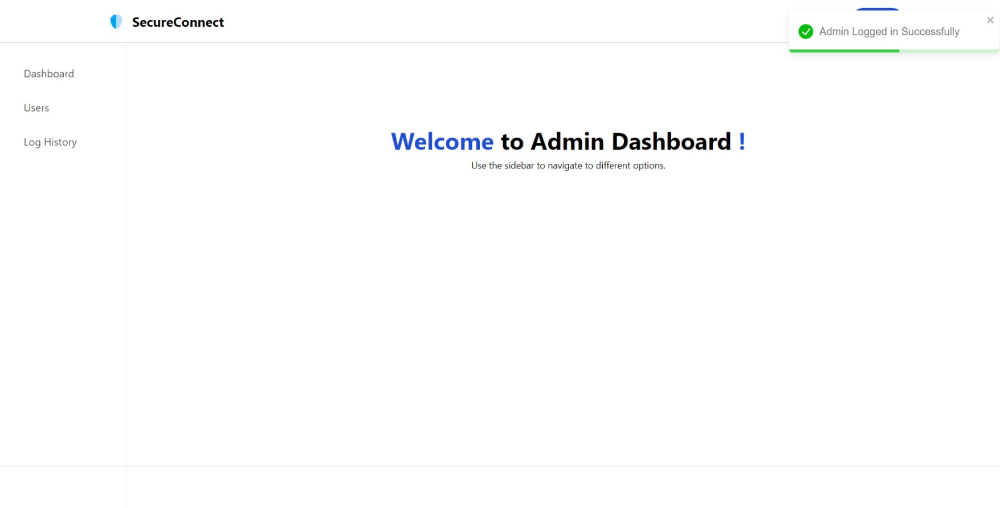

#### All Users
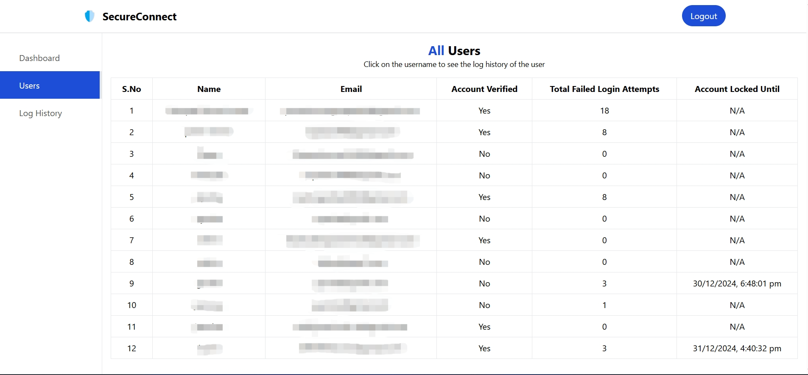

#### User Logs
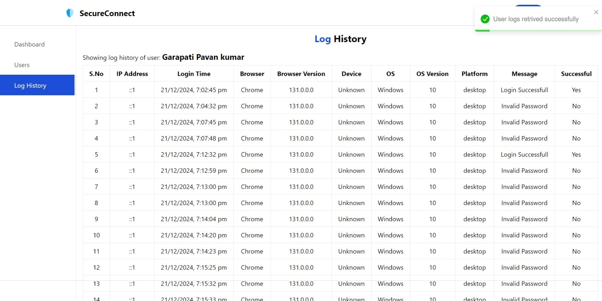

## Contact

For any inquiries or questions or if you need the project, please contact us at [pavankumargarapati04@gmail.com](mailto:pavankumargarapati04@gmail.com).